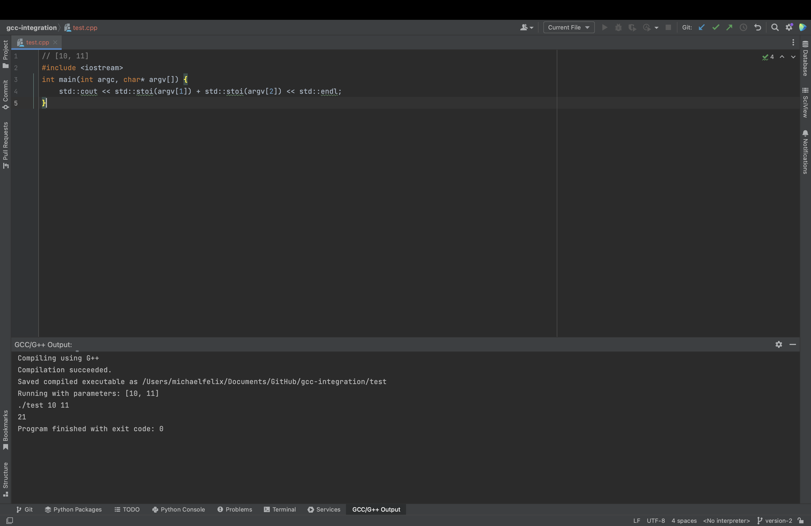

### Download Plugin

[JetBrains Marketplace](https://plugins.jetbrains.com/plugin/21574-gcc-g--integration)

[Latest GitHub Release](https://github.com/mike-fmh/gcc-integration/releases)

# GCC-Integration

gcc-integration is a JetBrains IDE Plugin specifically designed for IDEs that do not have c/cpp support such as PyCharm. Its functionality is simple - it adds a keyboard shortcut that can run the GCC/G++ compiler on the active file (GCC must be already installed and in your system PATH).

The default keyboard shortcut is `alt + G`.

----

## Dependencies

`GCC` must be installed separately. To download, follow these steps:

### Windows

1) Visit https://sourceforge.net/projects/mingw/ and download.
2) In the GUI under "basic setup", check off `mingw32` and `mingw32gcc-g++`
3) Click "Installation > Apply Changes"
4) Add MingW32 to your System path (`C:\MinGW\bin`)

### Mac

Run the command `brew install gcc`

----

## Installation

You can either install directly through PyCharm, or install from its GitHub releases.

- To install directly through PyCharm, open `PyCharm --> Settings --> Plugins` and search GCC/G++ Integration on the marketplace

- To manually install, visit the [latest GitHub release](https://github.com/mike-fmh/gcc-integration/releases) and download the `.jar`. Open `PyCharm --> Settings --> Plugins`, click the Settings cog and choose "Install Plugin from disk..."

Note that each version of PyCharm needs a specific plugin file, for example versions ending in 231 will only be compatibility with PyCharm version 231.

----

## Usage

If the file that's open in the editor is of type .c or .cpp, press `alt + G` to send it straight to the GCC/G++ compiler in a new IDE Tool Window. If the file successfully compiles, this plugin will also run the created executable in the same toolwindow.

### Modifying Compilation/Runtime Settings

You can add optional settings to the plugin per each file.

Adding inline comments to the active C/C++ file above all code can modify the behavior of compilation/running of the active file's code.

#### Settings Syntax:
- Add parameters when running the compiled exe:
  - `// [param1, param2, ...]`
- Add more source files in the compilation stage by listing their relative paths:
  - `// file1.c, file2.c, ../file3.c, ...`
  
#### Settings Syntax:
- Add parameters when running the compiled exe:
    - `[param1, param2, ...]`

### Adding Arguments/Parameters

By default, no parameters will be passed to the active file when it's run after compilation. To add parameters, add a comment above all code in the active file listing all desired parameters:

This supports adding files, integers, or anything else as parameters. If you add a file, treat it as if you're cd'd into the same directory as your c/cpp file.

