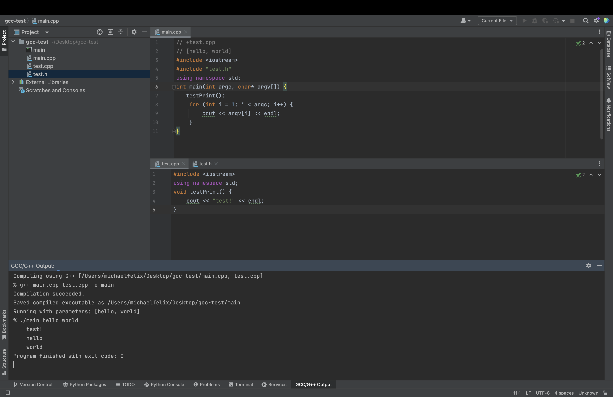

### Download Plugin

- [JetBrains Marketplace](https://plugins.jetbrains.com/plugin/21574-gcc-g--integration)

- [Latest GitHub Release](https://github.com/mike-fmh/gcc-integration/releases)

# GCC-Integration

gcc-integration is a JetBrains IDE Plugin specifically designed for IDEs that do not have c/cpp support such as PyCharm. Its functionality is simple - it adds a keyboard shortcut that can run the GCC/G++ compiler on the active file (GCC must be already installed and in your system PATH).

The default keyboard shortcut is `ctrl + G`.

----

## Dependencies

GCC must be installed separately. To download, follow these steps:

### Windows

1) Visit https://sourceforge.net/projects/mingw/ and download.
2) In the GUI under "basic setup", check off `mingw32` and `mingw32gcc-g++`
3) Click "Installation > Apply Changes"
4) Add MingW32 to your System path (`C:\MinGW\bin`)

### Mac

Run the command `brew install gcc`

----

## Installation

You can either install directly through PyCharm, or install from its GitHub releases.

- To install directly through PyCharm, open `PyCharm --> Settings --> Plugins` and search GCC/G++ Integration on the marketplace

## Manual Install

- To manually install, visit the [latest GitHub release](https://github.com/mike-fmh/gcc-integration/releases) and download the `.jar`. Open `PyCharm --> Settings --> Plugins`, click the Settings cog and choose `Install Plugin from disk...`

Note that each version of PyCharm needs a specific plugin file, for example the plugin version ending in 231 will only be compatibility with PyCharm version 231.

----

## Usage

If the file that's open in the editor is of type .c or .cpp, press `ctrl + G` to send it straight to the GCC/G++ compiler in a new IDE Tool Window. If the file successfully compiles, this plugin will also run the created executable in the same toolwindow.

### Modifying the Plugin's Behavior

You can add optional settings to the plugin per each file.

Adding inline comments to the active C/C++ file above all code can modify the behavior of compilation/running of the active file's code.

In this example we've added `test.cpp` as an additional source file for the plugin when it compiles `main.cpp`. We've also chosen the parameters of "hello" & "world" for the `main.cpp` file. The plugin determines which file is the "active file" based on which one you've clicked onto last.

As `main.cpp` is the active file while we press `ctrl + G` in this example, the plugin compiles it along with the specified additional source file `test.cpp`, and then runs the resulting executable with the specified params (hello, world).

For more information on configuring these types of settings, read on!

----

#### Settings Syntax:
- [Adding Arguments/Parameters](#adding-argumentsparameters)
    - `// [param1, param2, ...]` 
- [Adding Additional Source Files](#adding-additional-source-files)
    - `// +file1.c, +file2.c, +../file3.c, ...`

### Adding Arguments/Parameters

By default, no parameters will be passed to the active file when it's run after compilation. To add parameters, add a comment above all code in the active file listing all desired parameters:

    // [param1, param2, param3, ...]
    #include <stdio.h>
    int main() {};

This supports adding files, integers, or anything else as parameters. For file paths in parameters, you can either use an absolute path, or a relative path from the active file's directory.

### Adding Additional Source Files

Adding comments above the code that begin with `+file.c` will tell the plugin to compile the current file along with the ones specified.

You can use either of the follow syntax:

    // +file.cpp
    // +file2.cpp

---

    // +file.cpp, file2.cpp
